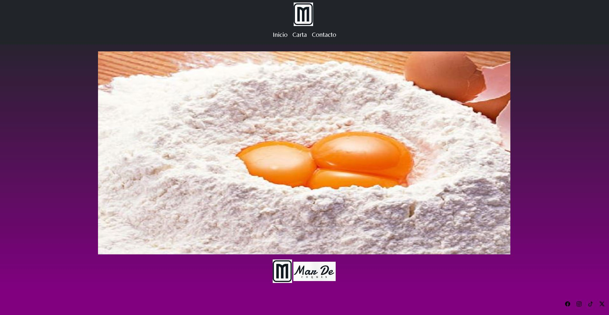
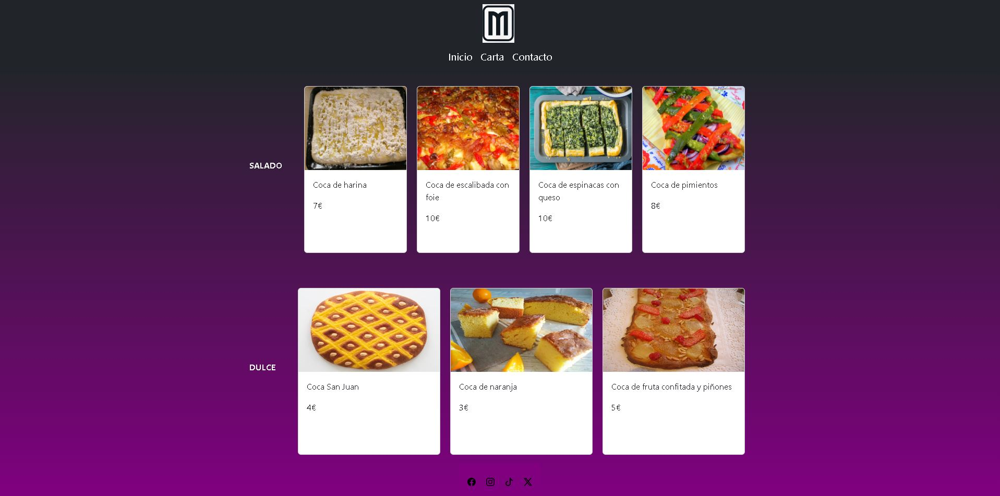
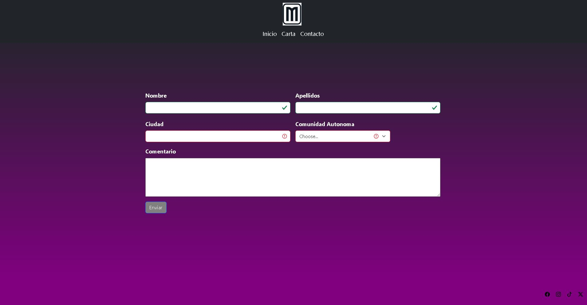

##### Proyecto 2: Web restaurante con Boostrap.
 

###### Principal

    
###### Carta

 
###### Contacto

    

#  Contenido:
 

- ### [Descripción del proyecto 📋](#Descripción-del-proyecto)
- ### [Acerca de 🍔](#Acerca)
- ### [Desarrollo 🖥️](#Desarrollo)
- ### [Repositorio GitHub 💾](#Repositorio)
- ### [Bugs 📜](#Bugs)

    

### Descripción del proyecto
 

#####  Este proyecto se basa en la creación de una web para un restaurantes de cocas usando Boostrap.

    

### Acerca de 

 

####  - He creado la web para un restaurante especialidado en cocas.
 

####  - Este resturante es un projecto que tiene un familiar en mente abrirlo en un corto plazo.​
 

 

    

### Desarrollo

 

####    Para este proyecto se ha utilizado HTML, CSS/Layout y BOOSTRAP  también contiene imágenes descargadas de internet.

####  El proyecto se basa en 3 páginas enlazadas entre ellas:
####  -La página principal que contiene imágenes que recuerdan a las cocas y unas de ejemplo.
####  - La carta que contiene las distintas secciones en que se divide la carta del restaurante.
####  -La página de contacto donde hay un formulario donde el usuario puede rellenar los campos como "nombre", "apellidos", "Ciudad", "Comunidad Autonoma" y una descripción.
####  -Es totalmente responsive, a excepcion de la carta. 

   

    

### Repositorio GitHub

 

#### https://github.com/BGMiralles/projWeb1
#### Linkedin:
### https://www.linkedin.com/in/borjagutierrezmiralles/

    

### Bugs

 

#### Bugs:

####  -La pagina de la carta no se ajusta a la pantalla de un movil, se montan las imagenes. En esta misma pagina se queda una linea blanco en el pie. Por ultimo, la lista de comunidades autonomas no esta ordena alfabeticamente.
 